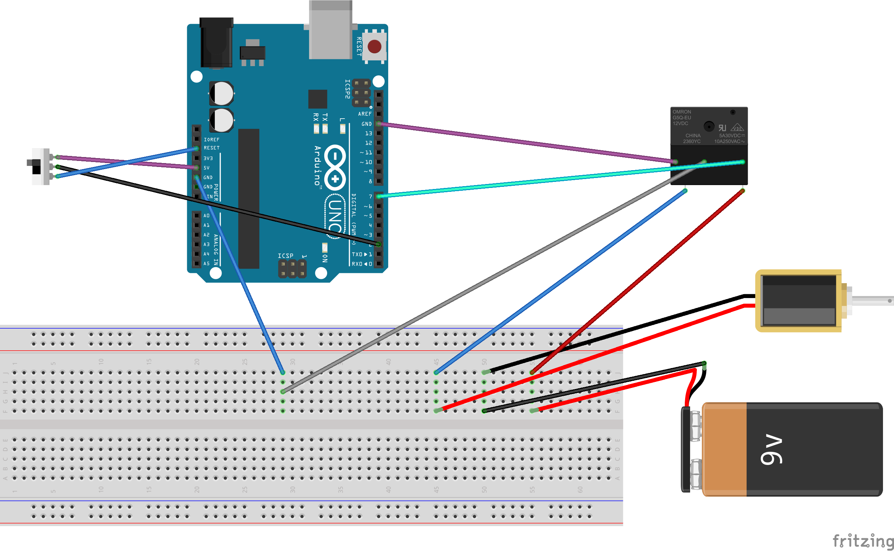
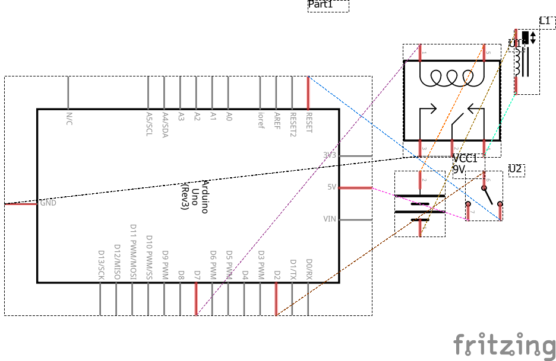

# Auto-Detection Security (Lock)

**Author(s)**: *Raymond Okyere-Forson & Elyor Tukhtasinov*

**Google Document**: *https://docs.google.com/document/d/1EXmQ7teX7KDZrPH5cdPVMI5438ql7kau7XEo_zoTTfA/edit?usp=sharing*

---
## Purpose
*Did you forget to lock? LockPro v1 has your back!*

Elyor's roommate frequently forgets to lock the door. Unfortunately, the dorm room doors in the Deep Green Residence Hall do not autolock themselves after left unlocked for an unreasonable amount of time (more than 5 minutes). The problem is that somebody else can access the dorm room and potentially steal Elyor's and his roommate's belongings. LockPro v1 will auto-lock the door after it has been left unlocked for 30 seconds. The lock also has an override button to unlock the door.

## Initial Design Plan
*To build LockPro v1, we will be using different hardware components along with the master code that will run the entire operation.*

- Arduino UNO
- Breadboard
- Relay
- Magnetic Lock (MagLock)
- Button
- Buzzer (5V)
- Power Supply (12V)
- Power Probes
- Connecting wires (Jumper Wires)
- Jumper Cables
- USB to micro USB cable
________________________________________________________________________________________________________________________________________

- Initializing constant and global variables
- Assigning pins to the appropriate components
- Turning on or off MagLock based on door sensor

*Please see attached file: LockPro_Start_Code.ino to view full pseudocode.*

**Breadboard**:

**Schematic**:

## Files
*The list of all files currently being used in this project.*

- Knock_example.ino: an example of code that uses piezo sensor to sense knocking (vibration)
- README.md: master file where we document everything about our project
- example-README.md: example of the master file with instructions that we have to follow in filling out our README.md
- images (folder): is a folder to store images to be inserted in README.md
- LockPro_Start_Code.ino: our master file for the code that currently contains the pseudocode
- MagLock Code_1.ino: Currently the best version of working code we have so far based on progress
- maglock_pro.ino: Trying to setup an auto-lock function of the system
- maglock_pro_v1.ino: Displaying progress of trying to make the code work
- maglock_pro_updated: Makes button unlock maglock, else it's always locked

## Summary

This project took us around 25 hours, and we were able to create a working lock system with automatic lock and emergency unlock features. As we worked on this project, we had to narrow down its scope, namely forgo the idea of being able to unlock the door using voice, vibration or keypad password as well as the idea of having a door sensor check whether the door is shut. This happened due to challenges presented by the hardware that we needed for an operatable autolock function.

At the prototype stage, after experimenting with a mock lock mimicked by an LED (off-open and on-locked), we received a magnetic lock and realized that the lock needs a 12V power supply, while the microcontroller is limitted to 5V. Therefore, we had to implement a relay to be able to control the maglock with the Arduino microcontroller. Due to scope limitatiomns, we replaced voice/sound/password lock/unlock feature, which we planned as an emergency feature to override the mechanism and unlock the door, with a simple button. We also experimented with a switch/door-sensor to design the feature that would autolock the door if the door sensor (or mimicked door sensor by a switch) shows that the door is shut but unlocked. However, we struggled with figuring out how to implement the door sensor, and agreed that the door sensor is out of the scope of the core problem that we are trying to solve, i.e. autolocking the lock after it was left open for 30 seconds. Therefore, we decided to let the door sensor go. At first we did not have an emergency unlock button, and our door-sensor/switch was inserted in between the microntroller and the relay, which controlled the current flow mechanically. We progressed with that and disconnected the emergency button from the relay and wired it exclusively to the to the microcontroller. We implemented the code to allow for control of the relay and respectively the lock via microcontroller based on the input from either emergency button or the program we wrote and loaded into the microcontroller. Last, we implemented a buzzer to enhance our autolock feature by making the autolock device notify the user by making sound when the lock is either locked or unlocked.

Along the way, we had troubles with proper wiring as well as scope and experience limitations. Nevertheless, we were able to overcome these challenges and solve the core problem.

## Instructions

- First, the normal state of the lock is being locked or on.
- To unlock the lock, press the button. The lock unlocks as you hear the beeping sound.
- After the lock is unlocked, you have 30 seconds until it locks back again. You will hear the beeping sound when the lock autolocks.

## Errors and Constraints

- There is no security mechanism implemented to unlock the door with a key or a password.

## Reflection

Wiring issues, problems solved as they come
Learned about relays, programming for microcomtroller
inputs/outputs, application of stuff we learned in electricity and electronics
learned how to use github outside of IDE

Scope limitations
Identifying what is relevant and irrelevant
Importance of being on the same page

Instructor should have found it more effective to have us learn by doing rather than giving us a crash course on major devices we can use and then assigning projects

## References

- Assistance was received from Cody Mitchell, Teaching Assistant, and Dr. Scott Heggen, course instructor
- Explored sensor (to determine whether Red or Green LED (lock imitation)): https://startingelectronics.org/articles/arduino/measuring-voltage-with-arduino/
- Explored piezoelectric Sensor (Learned about it in the Arduino: examples>sensors>knock): https://youtu.be/1SNC3ib10_4
- Explored voice-control features enabled by Arduino: https://www.instructables.com/id/How-to-Make-Voice-Controlled-LEDs-Using-Arduino/
- Explored voice-control features enabled by Arduino: https://play.google.com/store/apps/details?id=appinventor.ai_nitinpandit_00.Arduino_bluetooth_voice_controller&hl=en_IN
- Explored how relay works with arduino: https://randomnerdtutorials.com/guide-for-relay-module-with-arduino/

## Final Self-Evaluations

### Ideation, Brainstorming, Design:

*Partner 1 Elyor Tukhtasinov: 5*

*Partner 2 Raymond Okyere-Forson: 5*

### Code creation: 

*Partner 1 (replace this with your name): 5*

*Partner 2 (replace this with your name): 5*

### Documentation creation:

*Partner 1 (replace this with your name): 5*

*Partner 2 (replace this with your name): 5*

### Teamwork & Participation:

*Partner 1 (replace this with your name): 5*

*Partner 2 (replace this with your name): 5*

